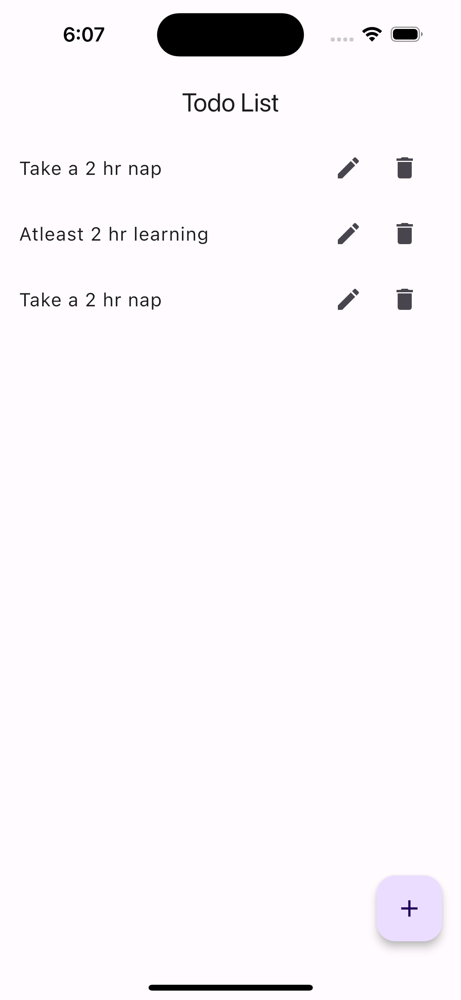
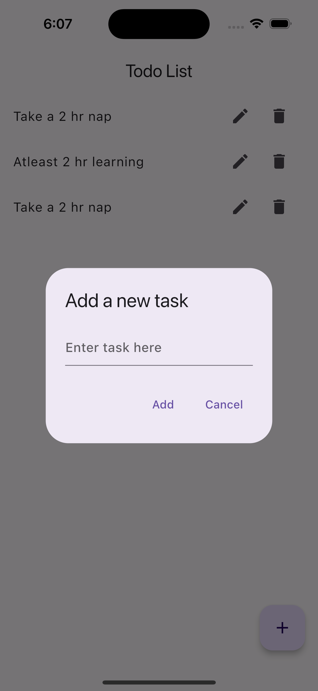
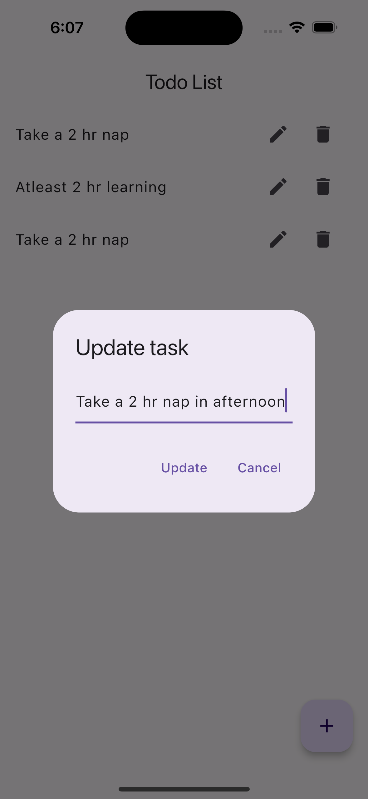
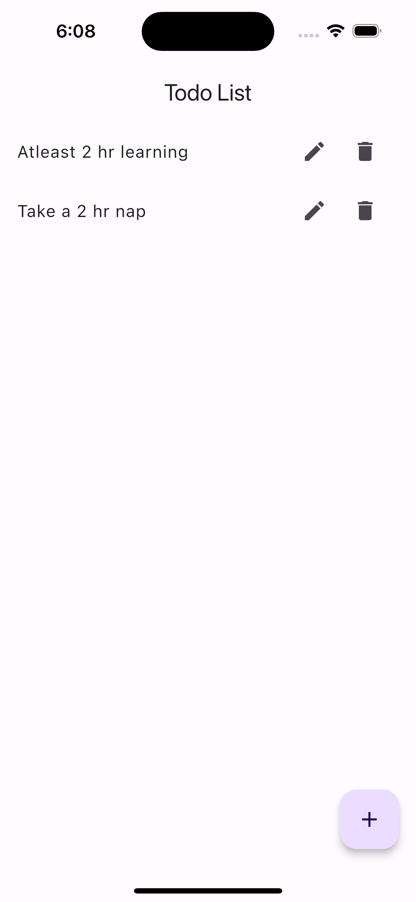

# Flutter Todos App

A simple and intuitive Todos app built using Flutter. This app helps you keep track of your daily tasks and organize your schedule effectively.

## Features

- Add, edit, and delete tasks
- Mark tasks as complete or incomplete
- Categorize tasks
- Simple and clean user interface

## Screenshots

### Home Screen
<p align="center">
  
</p>

### Add Task
<p align="center">
  
</p>

### Update Task
<p align="center">
  
</p>

### Delete Task
<p align="center">
  
</p>

## Getting Started

To get started with this project, follow the instructions below.

### Prerequisites

- Flutter SDK: [Install Flutter](https://flutter.dev/docs/get-started/install)
- Dart SDK: Included with Flutter
- IDE: Android Studio, IntelliJ, or Visual Studio Code with Flutter and Dart plugins installed

### Installation

1. Clone the repository
   ```bash
   git clone https://github.com/Vsjangal/Todo_flutter.git
   cd todo
   ```
2. Install dependencies 
   ```
   flutter pub get
   ```
3. Run the App
   ```
   flutter run
   ```
   or press F5(debug mode) to use hot reload feature 
